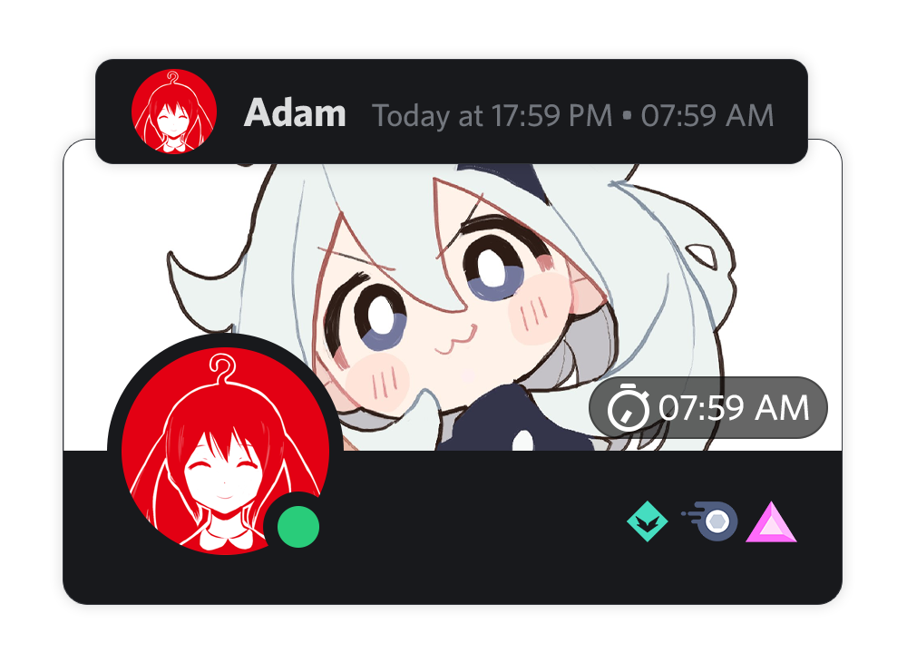

<h1>Timezones</h1>

<h4>No need to manually calculate your friends' current times. See directly on Discord</h4>

## Features

* Display the timer on the user popout, messages, and user lists
* Fully customizable, even in how the timer is displayed
* Check the user's timezone after some hours
* Get a timezone by the user's city
* Export and import user lists
* **[TimeTogether](https://timezonedb.bigdumb.gq/)** - An online database (Thanks @AAGaming00 for the hosting)

## Installation

### From this repository

1. Install [BetterDiscord](https://betterdiscord.app/)
2. [Go to here](https://github.com/abUwUser/BDPlugins/blob/compiled/Timezones/Timezones.plugin.js) and hit the "Raw" button, then press `CTRL/Command` + `S`, and save the file
3. Drag and drop the downloaded file to the BetterDiscord's plguins folder.
   - If you don't know how to open the BetterDiscord's plguins folder, open Discord's settings, scroll down, go to Plugins, and hit "Open Plugins Folder". It will open a folder in your file explorer. Then you drag and drop the plugin that you downloaded to there.